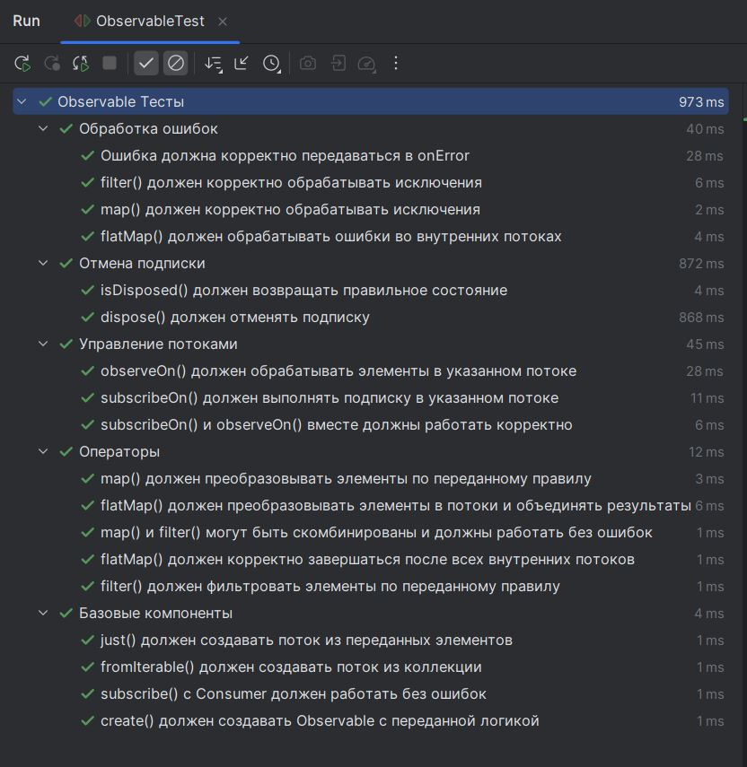

# RxJava-подобная библиотека

Библиотека, реализующая основные концепции реактивного программирования (RxJava) с нуля: управление асинхронными потоками данных, операторы преобразования, планировщики потоков и отмена подписки.

## Технологии

- **Java** 17
- **JUnit 5** 5.8.1 - тестирование
- **Maven** 3.6+ - управление зависимостями и сборка
- **Checkstyle** - проверка кодстайла
- **Spotless** - автоформат кода

## Требования

- Java 17
- Maven 3.6 или выше

## Архитектура

### Структура проекта

```
custom.rx/
    │
    ├── interfaces/
    │   ├── Observer.java               // Интерфейс подписчика (onNext, onError, onComplete)
    │   ├── Disposable.java             // Интерфейс отмены подписки (dispose, isDisposed)
    │   └── Scheduler.java              // Интерфейс планировщика потоков (execute)
    │
    ├── observers/                      // Реализации наблюдателей и операторов
    │   ├── SafeObserver.java           // Безопасная обёртка с поддержкой отмены
    │   ├── BaseObserver.java           // Базовый класс для проброса onError/onComplete
    │   ├── MapObserver.java            // Оператор преобразования элементов map
    │   ├── FilterObserver.java         // Оператор фильтрации элементов filter
    │   ├── FlatMapObserver.java        // Оператор слияния нескольких потоков flatMap
    │   └── ObserveOnObserver.java      // Оператор переключения потока обработки observeOn
    │
    ├── schedulers/                     // Планировщики потоков
    │   ├── IOScheduler.java            // Для ввода-вывода (CachedThreadPool)
    │   ├── ComputationScheduler.java   // Для вычислений (FixedThreadPool)
    │   └── SingleThreadScheduler.java  // Для последовательных задач (SingleThreadExecutor)
    │
    ├── Observable.java                 // Главный класс потока данных
    │
    └── Main.java                       // Демонстрация работы
```

### Описание функционала важнейших компонентов

#### Observable<T>
Главный класс, представляющий поток данных. Содержит:

**Фабричные методы:**
- `create(OnSubscribe)` - создаёт Observable с произвольной логикой подписки
- `just(T...)` - создаёт Observable из переданных элементов
- `fromIterable(Iterable<T>)` - создаёт Observable из коллекции

**Операторы:**
- `map(Function<T, R>)` - преобразует каждый элемент
- `filter(Predicate<T>)` - фильтрует элементы по условию
- `flatMap(Function<T, Observable<R>>)` - преобразует элементы в Observable и объединяет результаты

**Управление потоками:**
- `subscribeOn(Scheduler)` - задаёт поток для выполнения подписки
- `observeOn(Scheduler)` - задаёт поток для обработки элементов

**Подписка:**
- `subscribe(Observer<T>)` - подписка с полным Observer  (onNext, onError, onComplete)
- `subscribe(Consumer<T>)` - упрощённая подписка только на элементы
- `subscribe(Consumer<T>, Consumer<Throwable>)` - с обработкой ошибок
- `subscribe(Consumer<T>, Consumer<Throwable>, Runnable)` - с обработкой завершения

#### Операторы

| Класс | Назначение                                                                                 |
|-------|--------------------------------------------------------------------------------------------|
| `SafeObserver` | Потокобезопасная обёртка с поддержкой отмены подписки и проверками перед отправкой событий |
| `BaseObserver` | Базовый класс, пробрасывает `onError` и `onComplete` к подписчику                          |
| `MapObserver` | Применяет функцию преобразования к каждому элементу                                        |
| `FilterObserver` | Проверяет элементы на соответствие условию                                                 |
| `FlatMapObserver` | Преобразует элемент в Observable и объединяет результаты                                   |
| `ObserveOnObserver` | Переключает поток для обработки элементов                                                  |

#### Планировщики

| Класс | ExecutorService | Особенности | Применение                                        |
|-------|-----------------|-------------|---------------------------------------------------|
| `IOScheduler` | `Executors.newCachedThreadPool()` | Потоки создаются по мере необходимости и переиспользуются | Операции ввода-вывода (чтение файлов, запросы к БД, сетевые вызовы)            |
| `ComputationScheduler` | `Executors.newFixedThreadPool(Runtime.getRuntime().availableProcessors())` | Количество потоков равно числу ядер процессора | Вычислительные задачи (обработка данных, расчёты) |
| `SingleThreadScheduler` | `Executors.newSingleThreadExecutor()` | Все задачи выполняются последовательно в одном потоке | Операции, которые должны выполняться строго по порядку            |

#### Интерфейсы

| Интерфейс | Методы | Назначение |
|-----------|--------|------------|
| `Observer<T>` | `onNext()`, `onError()`, `onComplete()` | Подписчик |
| `Disposable` | `dispose()`, `isDisposed()` | Отмена подписки |
| `Scheduler` | `execute(Runnable)` | Планировщик потоков |

## Управление потоками (Schedulers)

### Принцип работы

`Scheduler` абстрагирует управление потоками от бизнес-логики. Позволяет легко менять поток выполнения без изменения кода

### subscribeOn vs observeOn

| Характеристика | subscribeOn                        | observeOn |
|----------------|------------------------------------|-----------|
| **Что делает** | Задаёт поток для запуска подписки  | Задаёт поток для обработки элементов |
| **На что влияет** | На код внутри `create()` и всю цепочку до первого `observeOn` | На операторы, которые идут после него |
| **Сколько раз можно применить** | Только один раз (ближайший к источнику) | Можно несколько раз в цепочке |
| **Типичное использование** | Вынести тяжёлую генерацию данных в фон | Переключиться на нужный поток для обработки или вывода |

## Примеры использования

### create() - ручное создание
```java
    Observable.create(
        observer -> {
        observer.onNext(10);
              observer.onNext(20);
              observer.onNext(30);
              observer.onComplete();
            }).subscribe(
        item -> System.out.println("  Получено: " + item),
        Throwable::printStackTrace,
        () -> System.out.println("  Поток завершён"));
```

### just() - из элементов
```java
    Observable.just(1, 2, 3).subscribe(item -> System.out.println("  Число: " + item));
```

### fromIterable() - из коллекции
```java
    List<String> names = Arrays.asList("A", "B", "C");
    Observable.fromIterable(names).subscribe(name -> System.out.println("  Буква: " + name));
```

### map() - преобразование элементов
```java
    Observable.just(1, 2, 3).map(x -> "Число: " + x).subscribe(System.out::println);
```

### filter() - фильтрация элементов
```java
    Observable.just(1, 2, 3, 4, 5, 6, 7, 8, 9, 10)
        .filter(x -> x % 2 == 0)
        .subscribe(x -> System.out.println("  Чётное: " + x));
```

### flatMap() - слияние потоков
```java
    Observable.just("1,2,3", "4,5,6", "7,8,9")
        .flatMap(
            s ->
            Observable.fromIterable(
                Arrays.stream(s.split(",")).map(Integer::parseInt).toList()))
        .subscribe(x -> System.out.print(x + " "));
```

### subscribeOn()
```java
    Observable.create(observer -> {
                System.out.println("Генерация в: " + Thread.currentThread().getName());
                observer.onNext("Привет");
                observer.onComplete();
            })
            .subscribeOn(Scheduler.io())
            .subscribe(x -> System.out.println("Получено: " + x));
```

### observeOn()
```java
    Observable.just(1, 2, 3)
        .observeOn(Scheduler.single())
        .map(
            x -> {
            System.out.println("Обработка в: " + Thread.currentThread().getName());
            return x * 10;
        })
        .subscribe(x -> System.out.println("Результат: " + x));
```

## Тестирование
### Структура тестов

Тесты описаны в самих тестах и разделены на 6 логических блоков:

| Блок | Описание | Количество тестов |
|------|----------|-------------------|
| **Базовые компоненты** | Проверка `create()`, `just()`, `fromIterable()`, `subscribe()` | 4 |
| **Операторы** | Проверка `map()`, `filter()`, `flatMap()` и их комбинаций | 5 |
| **Управление потоками** | Проверка `subscribeOn()`, `observeOn()` и их совместной работы | 3 |
| **Отмена подписки** | Проверка `dispose()` и `isDisposed()` | 2 |
| **Обработка ошибок** | Проверка ошибок в Observable, `map`, `filter`, `flatMap` | 4 |

**Итого: 18 тестов**


